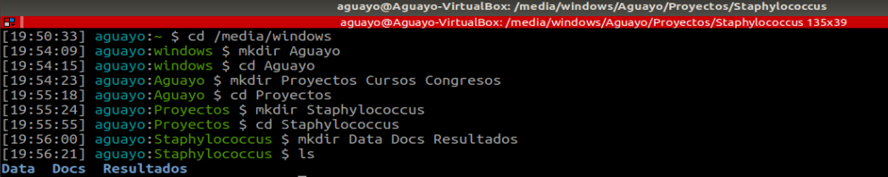
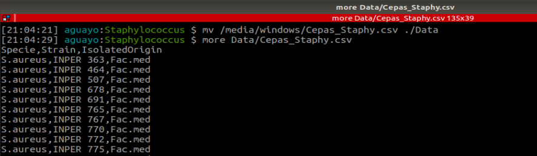
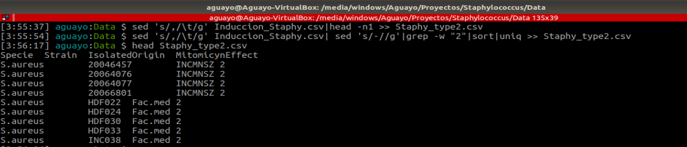
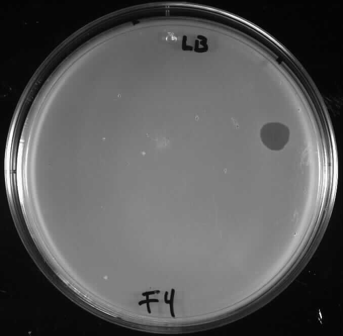
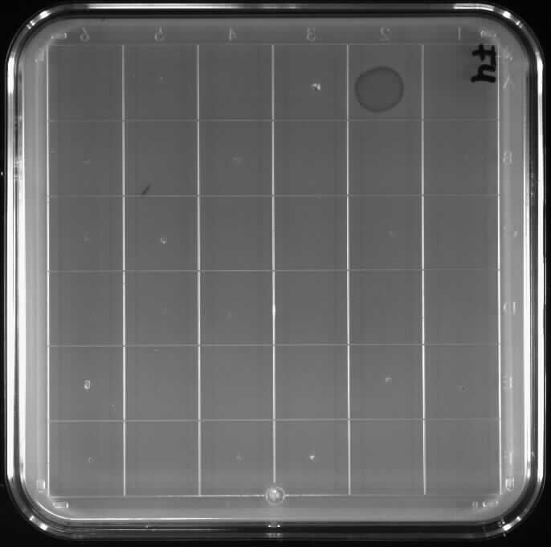

# Pregunta

¿Se da la lisogenia y que tan frecuente es en cepas de *Staphylococcus*?

# Hipotesis

Dado que la lisogenia es relativamente frecuente en cepas bacterianas, se deben encontrar cepas lisogénicas en la colección de cepas de *Staphylococcus* con las que contamos.

# Objetivo

Estandarizar la ténica de inducción de profagos de cepas de *Staphylococcus* con mitomicina para determinar la frecuencia de lisogenia de las cepas de esta especie.

# Diseño

La lisogenia es relativamente frecuente en cepas bacterianas. Un estudio concluyó que el 27% de las cepas estudiadas liberaron fago tras ser expuestas a mitomicina C (Yakokura, et al., 1974).

La lisis ha sido reportada que es fuertemente dependiente de la concentración de mitomicina C, la temperatura y la fase de los cultivos; y varía dependiendo de las cepas de que se trate.  En nuestro laboratorio trabajamos con cepas de Staphylococcus aureus. Actualmente tenemos 113 cepas de la colección del laboratorio del Dr. Roberto Cabrera de la Facultad de Medicina de la UNAM y 90 del Instituto Nacional de Ciencias Médicas y Nutrición Salvador Zubirán de la colección del labortorio del Dr. Luis Alfredo Ponce de León Garduño y la Dra. Areli Martínez

Nuestro objetivo es demostrar la lisogenia en cepas de Staphylococcus aureus. Para lo cual se debe estadarizar el procedimiento para tener las condiciones óptimas para el ensayo.

1. Para iniciar con el proyecto se recibieron 113 cepas provenientes de Facultad de Medicina de la UNAM y 90 del Instituto Nacional de Ciencias Médicas y Nutrición. Por lo cual para llevar un mejor manejo de los datos se procedio a crear el directrorio que albergaria toda la información obtenida.

```{bash, eval=FALSE, echo=TRUE}
$ cd /media/windows  
$ mkdir Aguayo  
$ cd Aguayo
$ mkdir Proyectos Cursos Congresos
$ cd Proyectos
$ mkdir Staphylococcus
$ cd Staphylococcus
$ mkdir Data Docs Resultados
$ ls
```



2. Posteriormente moveremos el documento con nuestros datos y lo visualizaremos

```{bash, eval=FALSE, echo=TRUE}
$ mv /media/windows/Cepas_Staphy.csv ./Data
$ more Data/Cepas_Staphy.csv
```



# Métodos

Cepas bacterianas. La cepas utilizadas son listadas en la Tabla 1

```{r}
read.csv(file = '~/Aguayo/Proyectos/Staphylococcus/Data/Cepas_Staphy.csv', header = TRUE)
```

## Medios 

Los medios usados para llevar acabo la inducción fueron PY y LB

## Condiciones 

Las conidicones estudiadas fueron el tiempo, medio y concentración.

## Inducción de Staphylococcus lisogénicos con mitomicina C. 

La inducción se llevó a cabo con 0.5 µg/ml de mitomicina. La mitomicina utilizada es mitomycin C de Streptomyces caespitosus de SIGMA.

Los organismos se cultivaron a 37 ºC y la turbidez se midió con un lector Thermo Scientific multiskan FC, equipado con un filtro a 630 nm. Se consideró que la inducción se produjo cuando se detectó una disminución en la densidad óptica del cultivo en presencia de la mitomicina C, comparada con el control sin mitomicina C. 

Los bacteriófagos se detectaron mediante análisis de goteo en ensayos de doble capa de partículas recolectadas por centrifugación de cultivos tratados con mitomicina C. Las placas se incubaron durante la noche y se observaron las capacidades de inhibición del crecimiento y formación de placas de las partículas de tipo fago.


# Resultados

## Clasificación

Se clasificó el compartamiento de la curva de crecimiento de acuerdo al efecto quer tuvó la mitomicina en comparacion con las curvas controles (sin mitomicina)

```{r}
library(tidyverse)
```

### Tipo 1

Dentro de esta categoria se clasificaron donde la mitomicina tuvo un efecto por debajo del 20 en la DO en comparacion con la curva control **Grafica 1: Mitomicyn Effect Type 1**

```{r}
read.csv('~/Aguayo/Proyectos/Staphylococcus/Data/Mitomicyn_Type1_DO.csv', header = TRUE) %>% ggplot(aes(x = Time, y= DO, color=Strain)) + geom_point() + geom_line() + labs(title = "Mitomicyn Effect Type 1") + theme(plot.title = element_text(face = "bold", color = "black", size = 15, hjust = 0.5))
```
### Tipo 2

En esta categoria la disminucion en la DO de la cepas con mitomicina se encuentra arriba del 50 % en comparación con la curva control

```{r}
read.csv('~/Aguayo/Proyectos/Staphylococcus/Data/Mitomicyn_Type2_DO.csv', header = TRUE) %>% ggplot(aes(x = Time, y= DO, color=Strain)) + geom_point() + geom_line() + labs(title = "Mitomicyn Effect Type 2") + theme(plot.title = element_text(face = "bold", color = "black", size = 15, hjust = 0.5))
```

### Tipo 3

Las DO de las cepas con mitomicina se encuentra disminuida entre el 20-50% con respecto de la curva control

```{r}
read.csv('~/Aguayo/Proyectos/Staphylococcus/Data/Mitomicyn_Type3_DO.csv', header = TRUE) %>% ggplot(aes(x = Time, y= DO, color=Strain)) + geom_point() + geom_line() + labs(title = "Mitomicyn Effect Type 3") + theme(plot.title = element_text(face = "bold", color = "black", size = 15, hjust = 0.5))

```

### Conteo cepas-tipo

De acuerdo a esta clasificación se obtuvo el siguiente numero de cepas para cada una

```{r}
read.csv('~/Aguayo/Proyectos/Staphylococcus/Data/Induccion_Staphy.csv', header = TRUE) %>% select(Strain, MitomicynEffect) %>% ggplot(aes(x = MitomicynEffect)) + geom_bar() + labs(title = "No.Strains by type", x= "Type") + theme(plot.title = element_text(face = "bold", color = "black", size = 15, hjust = 0.5))
```

## Actividad de las partículas de tipo fago inducidas. 

Se examinaron los lisados que contenían partículas de fago para determinar su capacidad para formar placas e inhibir el crecimiento cuando se colocaron en placas sobre cepas indicadoras adecuadas. 

Se filtraron las cepas con efecto por mitomicina de tipo 2 (lisis) para probarse por goteo en 20 cepas receptoras seleccionadas.

```{bash, eval=FALSE, echo=TRUE}
$ sed 's/,/\t/g' Induccion_Staphy.csv|head -n1 >> Staphy_type2.csv
$ sed 's/,/\t/g' Induccion_Staphy.csv| sed 's/-//g'|grep -w "2"|sort|uniq >> Staphy_type2.csv
$ head Staphy_type2.csv
```



Las partículas de las cepas de Staphylococcus mostraron capacidades diferentes de acuerdo al medio utilizado, tanto en formación de placa como de inhibición del crecimiento.

{width='300px'} {width='300px'}

Apartir de los resultados vistos en placa se hizo la siguiente base de datos considerando el tipo de medio, efecto de inhibición del crecimiento y formacion de placa, para cada uno de los aislados probados.

```{r}
read.csv('~/Aguayo/Proyectos/Staphylococcus/Resultados/Staphy_type2_plaqueo.csv', sep = '\t') %>% head()
```


# Conclusión

Las condiciones óptimas de lisis de las cepas de Staphylococcus inducidas por mitomicina son: medio LB a 37 ºC entre 6 a 8 horas después de la inducción, durante la fase logarítmica temprana.

